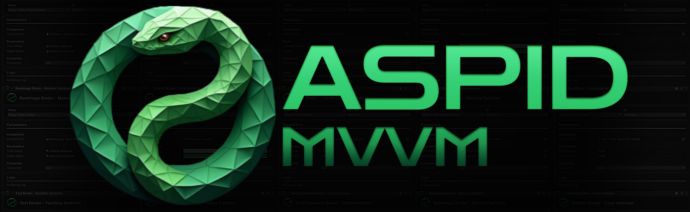

# Aspid.MVVM.Unity.Generators
**Aspid.MVVM.Unity.Generators** is a specialized source code generation tool designed to enhance development with
the [**Aspid.MVVM**](https://github.com/VPDPersonal/Aspid.MVVM/tree/main) framework in Unity projects
